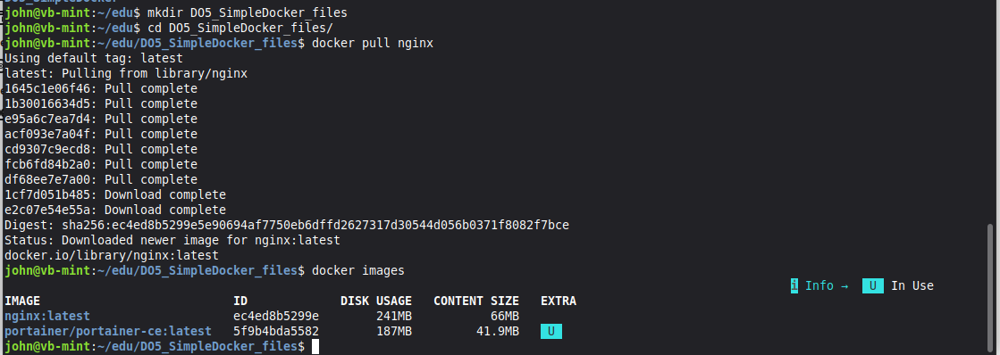
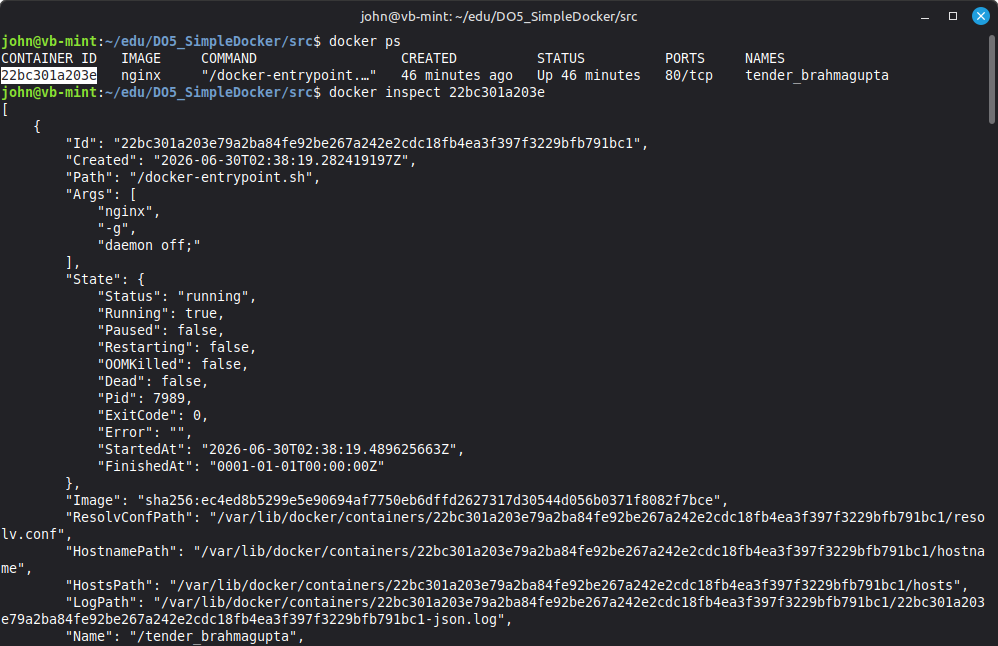
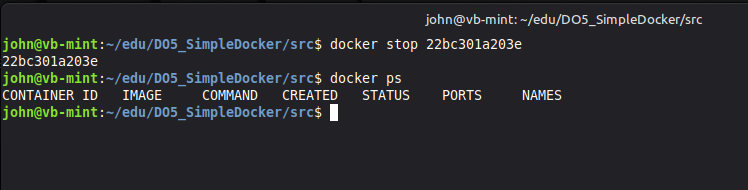
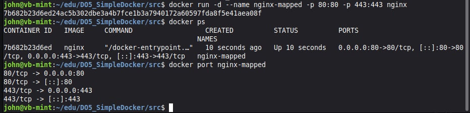
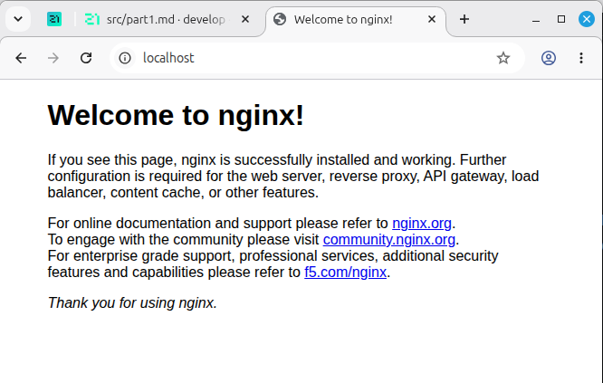
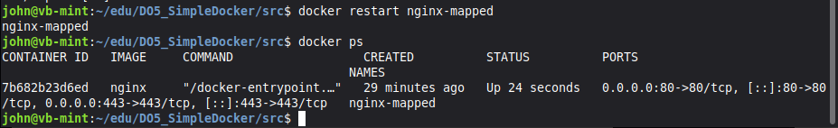

# Part 1. Готовый докер

**Скачать контейнер nginx** \
`docker pull nginx`

**просмотреть список контейнеров** \
`docker images`

**Создание и запуск контейнера** \
`docker run -d [image_id|repository]`

**Проверить что контейнер запустился** \
`docker ps`

**Просмотреть информацию о контейнере** \
`docker inspect [container_id|container_name]`

**По выводу команды определи и помести в отчёт размер контейнера, список замапленных портов и ip контейнера.** 

| Параметр | Значение |
|----------|----------|
| **Размер контейнера** | 63.1 MB (63,132,621 байт) |
| **Замапленные порты** | Не замаплены (`PortBindings: {}`) |
| **IP-адрес контейнера** | 172.17.0.2 |

**Остановить докер по [container_id|container_name]** \
`docker stop [container_id|container_name]`

**Просмотреть список запущенных контейнеров** \
`docker ps`

### Запусти докер с портами 80 и 443 в контейнере, замапленными на такие же порты на локальной машине, через команду run.

`docker run -d --name nginx-mapped -p 80:80 -p 443:443 nginx`

**Просмотреть mapped порты** \
`docker port [container_id|container_name]`

### Проверь, что в браузере по адресу localhost:80 доступна стартовая страница nginx.

**Перезапуск контейнера** \
`docker restart [container_id|container_name]`

## Другие полезные команды

**Дать контейнеру свое имя** \
`docker run -d --name my-nginx nginx` \
-d - запустить в фоновом режиме

**Просмотреть все контейнеры, даже остановленные** \
`docker ps -a`

**удалить остановленный контейнер** \
`docker rm nginx-mapped`

**удалить все остановленные контейнеры** \
`docker container prune`

**Присоединиться к работающему контейнеру** \
`docker attach [container_id|container_name]` \
`ctrl+p` или `ctrl+q` - остоединиться от контейнера не останавливая его

**Запуск ранее созданного контейнера** \
`docker start [container_id|container_name]`

**Удалить докер образ**
`docker rmi my-nginx`