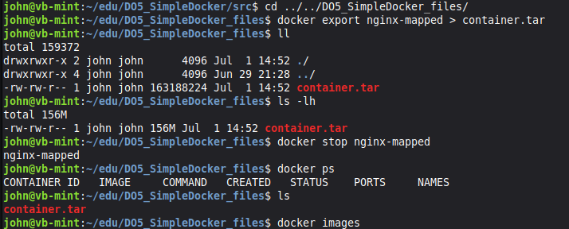
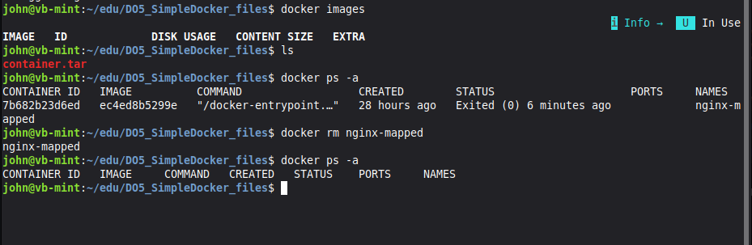
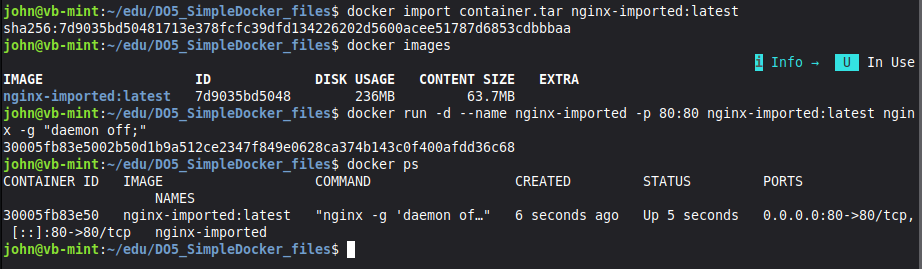
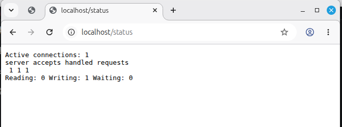

# Part 2. Операции с контейнером

**Прочитай конфигурационный файл nginx.conf внутри докер контейнера** \
`docker exec nginx-mapped cat /etc/nginx/nginx.conf`

**Создай на локальной машине файл nginx.conf.** \
**Настрой в нем по пути /status отдачу страницы статуса сервера nginx.**

**Скопируй созданный файл nginx.conf внутрь докер-контейнера**
`docker cp nginx.conf nginx-mapped:/etc/nginx/nginx.conf`

**Перезапусти nginx внутри докер-контейнера**
`docker exec nginx-mapped nginx -s reload`

**Проверь, что по адресу localhost:80/status отдается страничка со статусом сервера nginx.**

**Экспорт контейнера в файл .tar** \
`docker export nginx-mapped > container.tar`

**Остановить контейнер** \
`docker stop nginx-mapped`

**Удоли образ nginx** \
`docker rmi nginx:latest` \
`docker rmi -f nginx:latest`

**Удалить остановленный контейнер** \
`docker ps -a` \
`docker rm nginx-mapped`

**Создать образ из файла container.tar через команду import**
`docker import container.tar nginx-imported:latest` \
latest - тег контейнера. Можно указывать версию.

**Создасть и запустить контейнер на основе импортированного образа**
`docker run -d --name nginx-imported -p 80:80 nginx-imported:latest  nginx -g "daemon off;"`\
nginx -g "daemon off;" - запрещает уходить nginx в фон, а оставаться на переднем плане. Иначе докер остановит контейнер без работающих процессов \

**Проверь, что по адресу localhost:80/status отдается страничка со статусом сервера nginx.**

