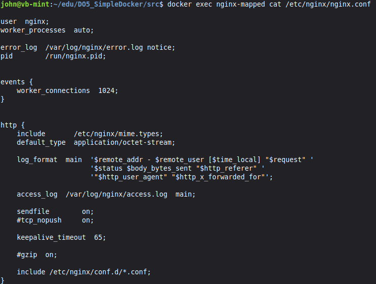
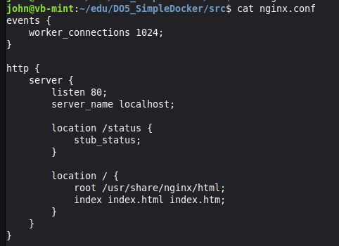
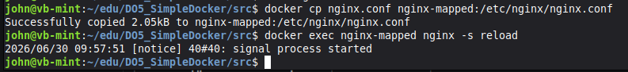
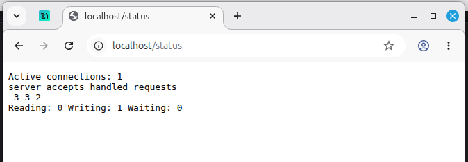

# Part 2. Операции с контейнером

**Прочитай конфигурационный файл nginx.conf внутри докер контейнера через команду exec** \
`docker exec nginx-mapped cat /etc/nginx/nginx.conf`

**Создай на локальной машине файл nginx.conf.** \
**Настрой в нем по пути /status отдачу страницы статуса сервера nginx.**

**Скопируй созданный файл nginx.conf внутрь докер-контейнера через команду docker cp**
`docker cp nginx.conf nginx-mapped:/etc/nginx/nginx.conf`

**Перезапусти nginx внутри докер-контейнера через команду exec.**
`docker exec nginx-mapped nginx -s reload`

**Проверь, что по адресу localhost:80/status отдается страничка со статусом сервера nginx.**

**По выводу команды определи и помести в отчёт размер контейнера, список замапленных портов и ip контейнера.** 

| Параметр | Значение |
|----------|----------|
| **Размер контейнера** | 63.1 MB (63,132,621 байт) |
| **Замапленные порты** | Не замаплены (`PortBindings: {}`) |
| **IP-адрес контейнера** | 172.17.0.2 |

## Другие полезные команды

**Дать контейнеру свое имя** \
`docker run -d --name my-nginx nginx`
