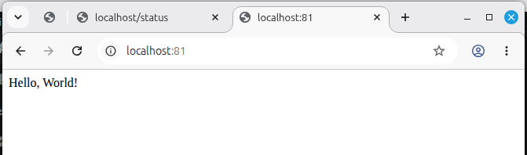

# Part 3. Мини веб-сервер

**мини-сервер на C и FastCgi** \
`#include <stdio.h>
#include <stdlib.h>
#include <string.h>
#include <fcgi_stdio.h>

int main() {
    // Бесконечный цикл ожидания запросов
    while (FCGI_Accept() >= 0) {
        // Отправляем HTTP-заголовки
        printf("Content-type: text/html\r\n\r\n");
        // Отправляем тело ответа
        printf("Hello, World!\n");
    }
    return 0;
}`

**Скомпилировать сервер** \
`gcc server.c -o server -lfcgi`

**Запуск сервера через spawn-fcgi** \
`spawn-fcgi -p 8080 -n ./server`

**или фоновый режим** \
`spawn-fcgi -p 8080 ./server`

**проверить что сервер запущен** \
`ps aux | grep server`
`netstat -tlnp | grep 8080`

**Создать server/nginx.conf** \
`events {
    worker_connections 1024;
}

http {
    server {
        listen 81;
        server_name localhost;

        location / {
            include fastcgi_params;
            fastcgi_pass 127.0.0.1:8080;
        }
    }
}`

**Проверить и запустить локальный nginx** \
*проверить конфиг на ошибки* \
`sudo nginx -t -c $(pwd)/nginx.conf`

*запустить nginx* \
`sudo nginx -c $(pwd)/nginx.conf`

**Проверить localhost:81**

