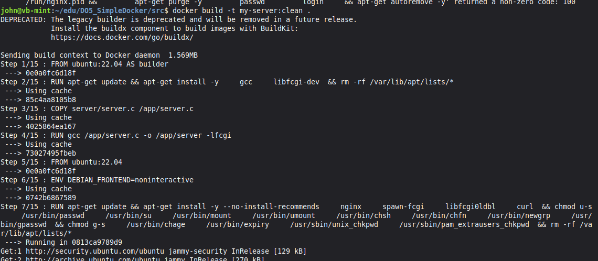
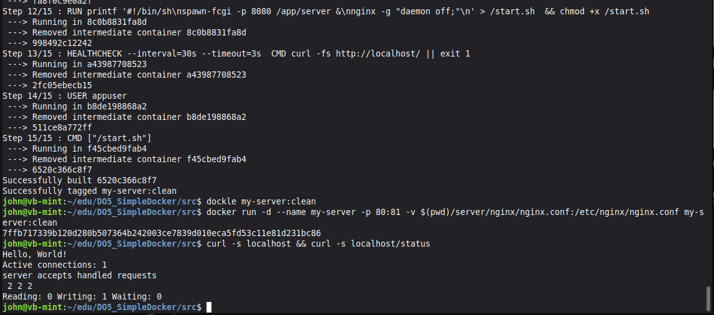

# Part 5. Dockle

## Этап 1: Проверка образа

**Проверка образа**
`dockle my-server:latest`


1. *FATAL - CIS-DI-0010: Do not store credential in environment variables/files
Suspicious ENV key found : NGINX_GPGKEYS* \
Dockle ругается на официальный образ nginx:latest.

2. *CIS-DI-0001: Create a user for the container* \
Не использовать root для запуска процессов

3. *DKL-DI-0006: Avoid latest tag* \
Не использовать тег latest. Писать номер версии

4. *CIS-DI-0006: Add HEALTHCHECK instruction to the container image* \
Не используется регулярная проверка работоспособности контейнера

## Этап 2: Новая сборка образа с учетом dockle report


**src/Dockerfile**
```docker
# ======================
# BUILD
# ======================
FROM ubuntu:22.04 AS builder

RUN apt-get update && apt-get install -y \
    gcc \
    libfcgi-dev \
 && rm -rf /var/lib/apt/lists/*

COPY server/server.c /app/server.c

RUN gcc /app/server.c -o /app/server -lfcgi

```

*FROM ubuntu:22.04 AS builder* \
Указыват базовый образ Ubuntu как builder

*RUN apt-get update && ...* \
Каждая команда RUN создает новый слой образа (слепок), поэтому обьединяем несколько команд в одну чтобы не увеличивать размер

*COPY server/server.c /app/server.c* \
скопировать server.c в контейнер

*RUN gcc /app/server.c -o /app/server -lfcgi* \
Скомпилировать ./server в контейнере

Созданный на первом этапе контейнер необходим только для компиляции итоговгоо бинарного файла "server". 

## Этап 2: Финальный образ без nginx сборки. Раз она такая ошибочная. 

дописываем в файл сборки src/Dockerfile второй этап
```docker
# ======================
# RUNTIME
# ======================
FROM ubuntu:22.04

ENV DEBIAN_FRONTEND=noninteractive

#установить обновления. Не устанавливать рекомендованные пакеты
#отключить неиспользуемые утилиты
#очистить установочный кеш
RUN apt-get update && apt-get install -y --no-install-recommends \
    nginx \
    spawn-fcgi \
    libfcgi0ldbl \
    curl \
 && chmod u-s \
    /usr/bin/passwd \
    /usr/bin/su \
    /usr/bin/mount \
    /usr/bin/umount \
    /usr/bin/chsh \
    /usr/bin/chfn \
    /usr/bin/newgrp \
    /usr/bin/gpasswd \
 && chmod g-s \
    /usr/bin/chage \
    /usr/bin/expiry \
    /usr/sbin/unix_chkpwd \
    /usr/sbin/pam_extrausers_chkpwd \
 && rm -rf /var/lib/apt/lists/*

# Добавляем non-root user
RUN useradd -r -u 1001 -s /usr/sbin/nologin appuser

# Скопировать из сборки билдер скомпилированный сервер
COPY --from=builder /app/server /app/server

# скопировать конфиг nginx с локалхоста.
COPY server/nginx/nginx.conf /etc/nginx/nginx.conf

# создать папки для работы nginx и дать права пользователю appuser
# который буде запускать сервер и nginx
RUN mkdir -p \
        /var/cache/nginx \
        /var/lib/nginx \
        /var/log/nginx \
        /run \
	&& touch /run/nginx.pid \
	&& chown -R appuser:appuser \
        /app \
        /etc/nginx \
        /var/cache/nginx \
        /var/lib/nginx \
        /var/log/nginx \
        /run/nginx.pid

# Записываем скрипт запуска
RUN printf '#!/bin/sh\n\
spawn-fcgi -p 8080 /app/server &\n\
nginx -g "daemon off;"\n' > /start.sh \
 && chmod +x /start.sh

# Настроить проверку работы сервера
HEALTHCHECK --interval=30s --timeout=3s \
 CMD curl -fs http://localhost/ || exit 1

# Переключаемся на юзера appuser
USER appuser

# запускаем сервер и nginx
CMD ["/start.sh"]
```

*FROM ubuntu:22.04*
Соберем nginx сервер самостоятельно с базовой Ubuntu

*RUN apt-get update && apt-get install -y --no-install-recommends* \
Устанавливаем spawn-fcgi — утилиту для запуска FastCGI-серверов \
Она нужна, чтобы запустить наш сервер на порту 8080 \
отключаем ненужные утилиты

*COPY --from=builder /app/server /app/server* \
Копирует скомпилированный бинарник из этапа builder

*RUN mkdir -p* \
Создаем папки и файлы для работы nginx. Даем права appuser использовать их

*RUN printf '#!/bin/sh\n\ ..* \
Создаем скрипт запуска сервера в фоне и nginx на главном  /app/start.sh
```bash
#!/bin/sh
spawn-fcgi -p 8080 /app/server &
exec nginx -g "daemon off;"
```
spawn-fcgi -p 8080 /app/server & — запускает сервер на порту 8080 в фоне (&) \
nginx -g 'daemon off;' — запускает nginx на переднем плане \
-g 'daemon off;' — запрещает nginx уходить в фон (чтобы контейнер не умирал)

*chmod +x /app/start.sh* \
делаем скрипт исполняемым

*CMD ["/app/start.sh"]* \
Выполнить команду при старте контейнера


## Этап 3. Сборка образа и проверка

**docker build -t my-server:clean .** \
Запуск сборки по инструкциям Dockerfile в текущей директории \


проверка dockle \
проверка curl localhost/


**docker run -d --name my-server -p 80:81 -v $(pwd)/server/nginx/nginx.conf:/etc/nginx/nginx.conf my-server:clean** \
Запуск контейнера с маппингом папки ./nginx внутрь контейнера

**dockle my-server** \
проверка Dockle на безопасность и ошибки

**curl -s localhost && curl -s localhost/status** \
проверить работу сервера и nginx статуса

**Посмотреть какой процесс занимает 80й порт** \
`sudo ss -tlnp | grep :80`

**Остановить nginx на локальном хосте :80** \
`systemctl stop nginx`

**Перезапустить nginx в контейнере** \
`docker exec my-container nginx -s reload`

**Перезапустить контейнер** \
`docker restart my-container`