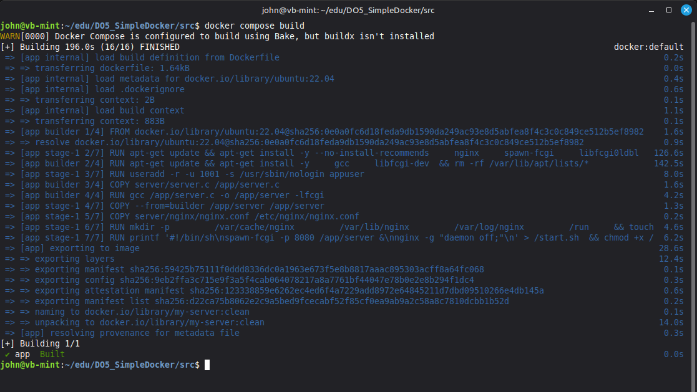
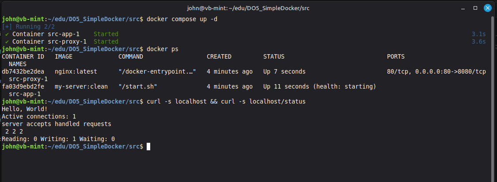

# Part 6. Docker composer

## docker-compose.yaml

**src/docker-compose.yaml**
```docker
services:

  # Собираем первый контейнер 'app'
  app:
    build: 
      context: .
      dockerfile: Dockerfile
  # Образ для контейнера
    image: my-server:clean
    # Порты с хоста не мапим. Сервер слушает только 81 порт внутри образа.
  # Подключить контейнер к сети 'app-network'
    networks:
      - app-network
  # Будет перезапускать контейнер пока не остановить в его ручную
    restart: unless-stopped

  # Собираем второй контейнер 'nginx'
  proxy:
    image: nginx:latest
    ports:
      # Мапим 80й порт локальной машины в контейнер nginx на порт 8080
      - "80:8080"
    volumes:
      # В конфиге для контейнера nginx стоит проксирование listen 8080
    # и перенаправление в первый контейнер proxy_pass http://app:81 через локальный DNS
      - ./nginx/nginx.conf:/etc/nginx/nginx.conf
  # Порядок запуска. Сначала будет запущен app, только потом nginx
    depends_on:
      - app
    networks:
      - app-network
    restart: unless-stopped

# Создаем виртуальную локальную сеть для контейнеров
networks:
  app-network:
    driver: bridge
```


**Собрать контейнеры по инструкции yaml** \
`docker compose build`




**Запустить контейнеры в фоне** \
`docker compose up -d`


запуск контейнеров и проверка localhost


## Как проходит запрос

После запуска `docker compose up` создаются два контейнера, объединённые в одну внутреннюю сеть Docker (`app-network`):

- **proxy** — контейнер с `nginx`;
- **app** — контейнер с FastCGI-сервером.

Контейнер `app` не публикует свои порты наружу и доступен только внутри сети Docker.

Схема прохождения запроса:

```text
Браузер
    │
    │ HTTP
    ▼
localhost:80
    │
    │ (маппинг порта 80 → 8080 контейнера proxy)
    ▼
┌────────────────────┐
│ proxy (nginx)      │
│ listen 8080        │
└─────────┬──────────┘
          │
          │ proxy_pass http://app:81
          ▼
┌────────────────────┐
│ app                │
│ nginx listen 81    │
└─────────┬──────────┘
          │
          │ fastcgi_pass 127.0.0.1:8080
          ▼
┌────────────────────┐
│ FastCGI-сервер     │
│ server.c           │
│ порт 8080          │
└────────────────────┘
```

### Подробно

1. Пользователь открывает страницу `http://localhost`.
2. Запрос попадает на **80 порт локальной машины**.
3. Docker перенаправляет его на **8080 порт контейнера `proxy`**.
4. `nginx` в контейнере `proxy` получает запрос и пересылает его на контейнер `app` по адресу `http://app:81`.
5. `nginx` внутри контейнера `app` принимает запрос на **81 порту**.
6. Затем `nginx` передаёт запрос FastCGI-серверу через `fastcgi_pass 127.0.0.1:8080`.
7. Программа `server.c` формирует ответ `Hello, World!`.
8. Ответ проходит обратный путь:
   - FastCGI → nginx (`app`);
   - nginx (`app`) → nginx (`proxy`);
   - nginx (`proxy`) → браузер.

В результате пользователь получает страницу **Hello, World!**, хотя приложение работает внутри нескольких контейнеров.


## Полезные команды

**Остановить и удалить все контейнеры** \
`docker compose down`

**Просмотреть журналы сервисов** \
`docker compose logs -f [service name]`

**Просмотерть список контейнеров** \
`docker compose ps`

**Выполнить команду в контейнере** \
`docker compose exec [service name] [command]`

**Вывести список образов** 
`docker compose images`

